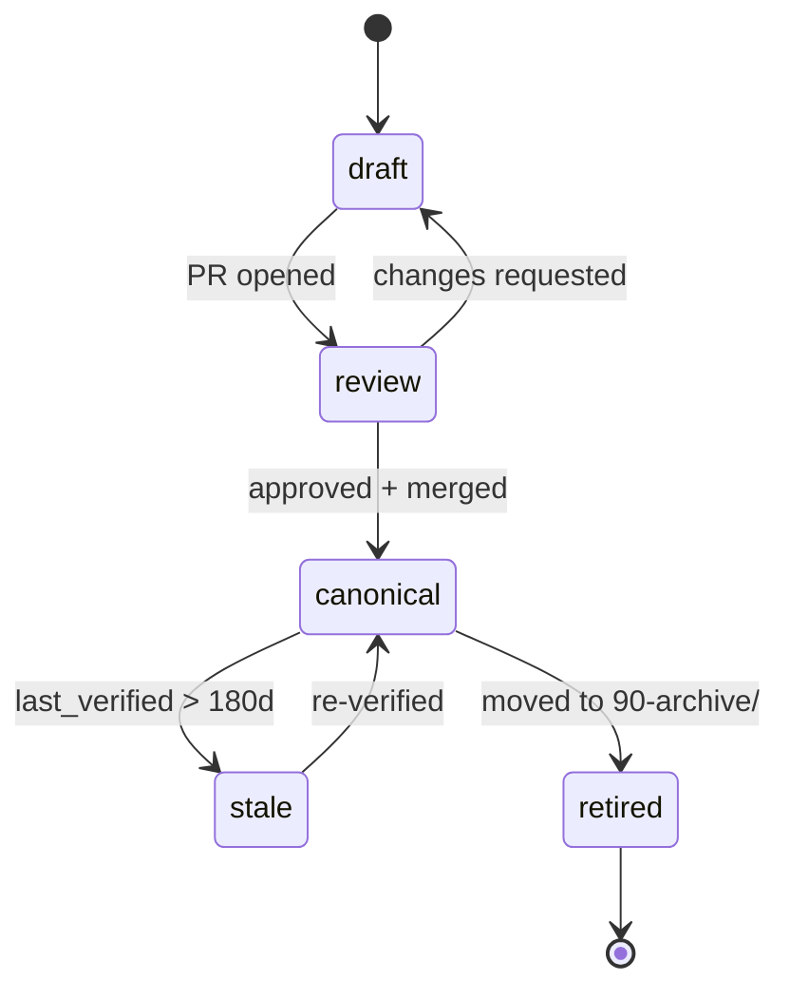

# Frontmatter Specification

The YAML block at the top of every doc in this site is a **machine-checked contract**, not decoration. CI parses it; missing or invalid fields fail the build.

## Where it goes

Line 1 of every `.md` file. The file starts with `---` on line 1, the YAML body, and a closing `---`. After the closing fence, the first content is a single `#` H1 that matches `title`.

```markdown
---
title: How to add a domain
owner: "@yhia"
status: draft
last_verified: 2026-06-10
diataxis_mode: how-to
audience: engineering
---

# How to add a domain

…
```

## Required fields

| Field | Type | Allowed values | Notes |
|---|---|---|---|
| `title` | string | sentence case | Matches the H1 (case-insensitive). No trailing period. |
| `owner` | string | `@<github-handle>` | Single owner. Use `null` only with explicit justification in the file body. |
| `status` | enum | `draft` \| `review` \| `canonical` \| `retired` | `stale` is set by CI, not by authors. |
| `last_verified` | date | `YYYY-MM-DD` | Updated whenever the doc is touched meaningfully. |
| `diataxis_mode` | enum | `tutorial` \| `how-to` \| `reference` \| `explanation` | Required even for C4 and runbook files — pick the closest match. |
| `audience` | enum | `engineering` \| `engineering,product` | Multi-audience docs are allowed but discouraged. |

CI fails the build if any of these is missing or invalid.

## Optional fields

| Field | Type | When to use |
|---|---|---|
| `c4_level` | enum `context` \| `container` \| `component` \| `code` | Only in `40-architecture/`. |
| `sources` | list of `[ref: path/to/file.ts:42]` | When the doc makes claims that must be traceable to code. |
| `supersedes` | path | When this doc replaces an older one. Drives retirement. |
| `estimated_time` | string `Nm` or `Nh` | For how-tos. |
| `severity` | enum `low` \| `medium` \| `high` \| `critical` | For runbooks. |
| `generated` | bool `true` | Codegen-produced files. Authored humans must not edit. |
| `codegen_source` | path | The source file the generated doc derives from. |

## Status lifecycle



`stale` is set by CI on a daily schedule, not by authors. The build does not fail on `stale` — it surfaces a warning in PRs touching stale docs.

## Validation rules

The validator (`scripts/lint/frontmatter-validator.ts`) enforces:

1. All required fields present and non-empty.
2. `title` matches the H1 (case-insensitive, normalized whitespace).
3. `last_verified` is a valid ISO date and not in the future.
4. `status` is one of the allowed values.
5. `diataxis_mode` is one of the allowed values.
6. If `c4_level` is set, the file path starts with `40-architecture/`.
7. If `generated: true`, the file begins with the codegen marker (see [codegen-pipeline.md](codegen-pipeline.md)).
8. Every entry in `sources` matches the regex `^[a-zA-Z0-9_\-/.]+:\d+(-\d+)?$`.

## Staleness policy

A doc is `stale` if `last_verified` is more than 180 days old. Stale docs are not blocked from merge, but:

- They appear with a `⚠ stale` badge in the rendered index.
- PRs that touch the same folder get a bot reminder to also re-verify them.
- After 365 days, the `owner` is paged to re-verify or retire.

## Example: a valid frontmatter block

```yaml
---
title: How to add a tRPC procedure
owner: "@yhia"
status: canonical
last_verified: 2026-06-10
diataxis_mode: how-to
audience: engineering
estimated_time: 10m
sources:
  - api/trpc/router.ts:13
  - api/trpc/procedures.ts:1
---
```

## Example: codegen frontmatter

```yaml
<!-- codegen:source=api/trpc/router.ts -->
<!-- DO NOT EDIT — regenerate via `pnpm codegen:trpc` -->
---
title: tRPC Procedures
owner: "@yhia"
status: canonical
last_verified: 2026-06-10
diataxis_mode: reference
audience: engineering
generated: true
codegen_source: api/trpc/router.ts
---
```

The `<!-- codegen:source=… -->` HTML comment is the only inline HTML allowed in the site. It is a marker, not rendered content; it survives all markdown renderers.

## Related

- [documentation-policy.md](documentation-policy.md) — the policy this contract implements
- [lint-rules.md](lint-rules.md) — what the validator does at CI time
- [codegen-pipeline.md](codegen-pipeline.md) — how generated files are marked
- [CONTRIBUTING.md](../CONTRIBUTING.md) — practical workflow
