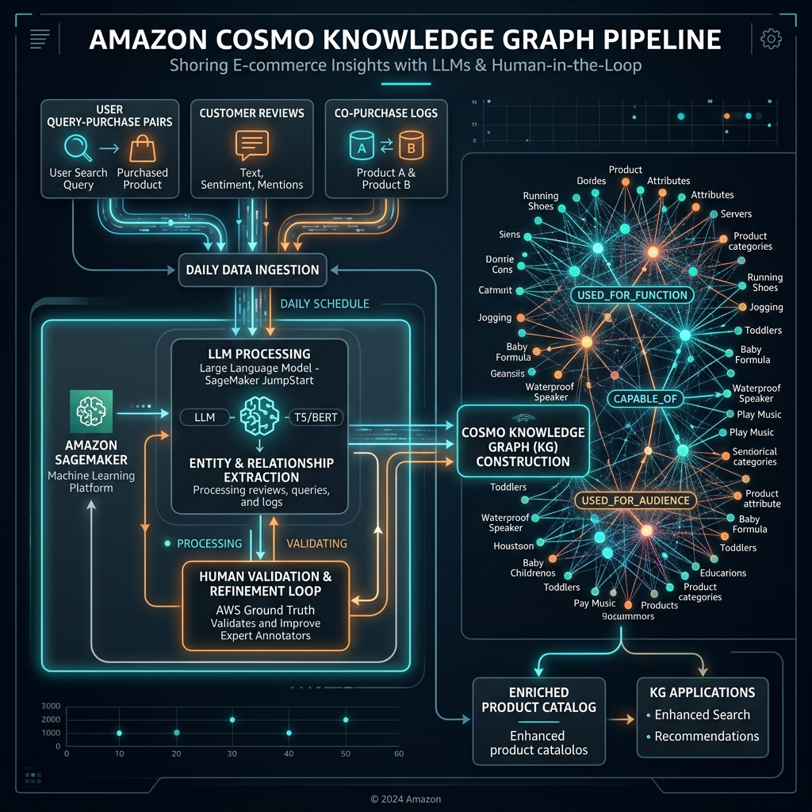
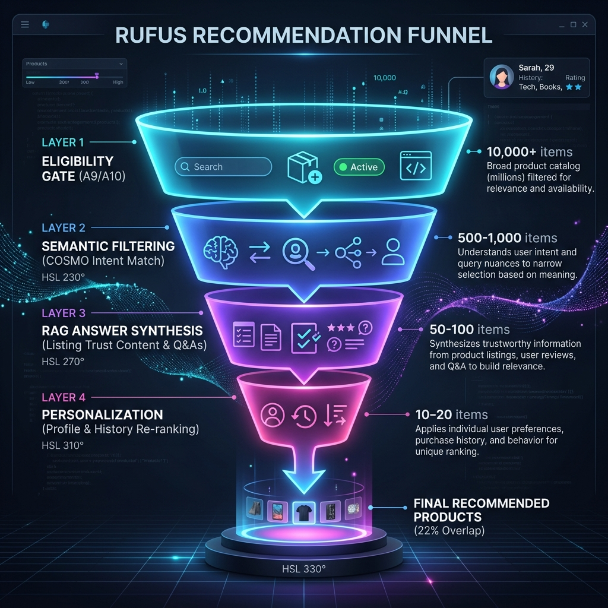
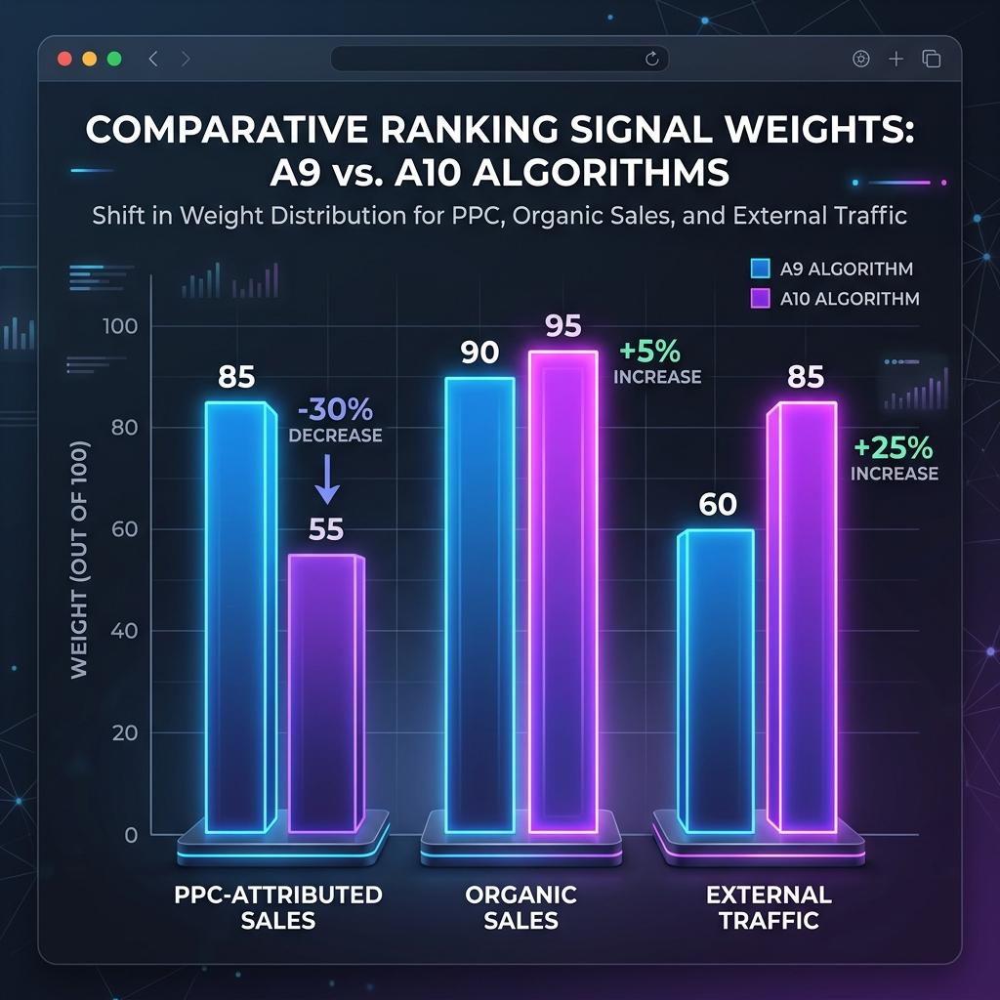

# Will Intent-Based PPC Campaigns Boost Rufus Recommendations After Semantic Listing Optimization?

## TL;DR

**The direct causal link is weaker than assumed, but the indirect flywheel is real and strategically valuable.** Amazon's COSMO knowledge graph ingests all query-purchase pairs regardless of whether the click was paid or organic — the raw data pipeline does not discriminate at the ingestion layer. However, the A10 organic ranking algorithm explicitly weights PPC-attributed sales lower than organic sales, which means the primary mechanism by which PPC would accelerate Rufus recommendations (driving organic rank on semantic keywords) operates at reduced efficiency. The most effective strategy is a **sequenced approach**: (1) semantic listing optimization first, (2) PPC structured strictly as an "organic rank conquesting" tool targeting Page 2 positions, (3) heavy investment in Q&A seeding (the #1 Rufus signal — listings with 15+ Q&As are recommended **3.2× more often**), and (4) external traffic via Amazon Attribution as the highest-weight signal for COSMO's daily-refreshed knowledge graph. If the direct PPC-to-Rufus flywheel underperforms, the fallback is packaging your semantic gap analysis as an **Answer Engine Optimization (AEO) audit service** ($2,500–$5,000 per audit, $3,000–$8,000 monthly retainers), which is a higher-margin, non-advertising revenue stream independent of PPC campaign performance.

---

## 1. How COSMO Actually Ingests Purchase Behavior Data

### 1.1 The Query-Purchase Pair: COSMO's Fundamental Building Block

Amazon's COSMO system, presented at ACM SIGMOD 2024, builds its commonsense knowledge graph from four primary data sources: **query-purchase pairs**, **co-purchase pairs**, **review content**, and **product descriptions**  [(Amazon Science)](https://www.amazon.science/blog/building-commonsense-knowledge-graphs-to-aid-product-recommendation) . The Amazon Science paper defines query-purchase pairs formally as: "the query-product pair (q,p) that customers click the query q and finally purchase the product p within short sessions"  [(amazon.science)](https://assets.amazon.science/8f/0a/0bfafe8843bf98a007a5328f2ae2/cosmo-a-large-scale-e-commerce-common-sense-knowledge-generation-and-serving-system-at-amazon.pdf) . This definition is agnostic to whether the click originated from a sponsored placement or an organic search result. From a data architecture standpoint, both pathways generate the same raw event — a user searched for something, clicked a product, and purchased it within a session window. COSMO's pipeline ingests these behavior logs daily via Amazon SageMaker, processes them through an LLM to generate structured relations (used_for_function, capable_of, used_for_audience, etc.), filters them through human annotators, and updates the knowledge graph's 29 million edges across 6.3 million nodes  [(ByteByteGo Newsletter)](https://blog.bytebytego.com/p/how-amazon-uses-llms-to-recommend) .

**Figure 3: The COSMO Knowledge Graph Pipeline** — PPC clicks and organic clicks both enter the system as query-purchase pairs at the ingestion layer. The critical question is whether downstream filtering or weighting treats them differently.

### 1.2 Does COSMO Differentiate Between Paid and Organic Conversions?

The Amazon Science publication does **not** explicitly state that COSMO's knowledge graph construction pipeline differentiates between paid and organic query-purchase pairs. The formal definition of a query-purchase pair makes no reference to click source — it only requires that a customer "click the query q and finally purchase the product p within short sessions"  [(amazon.science)](https://assets.amazon.science/8f/0a/0bfafe8843bf98a007a5328f2ae2/cosmo-a-large-scale-e-commerce-common-sense-knowledge-generation-and-serving-system-at-amazon.pdf) . This is consistent with how knowledge graphs are typically constructed: they model relationships between entities (products, queries, intents) based on observed behavioral co-occurrence, not based on the commercial mechanism that facilitated the interaction.

However, this does **not** mean that PPC conversions carry equal weight throughout Amazon's entire recommendation ecosystem. Two critical distinctions must be made. First, COSMO is a **knowledge graph generation system** — it produces structured commonsense knowledge that feeds into downstream applications like search relevance, session-based recommendation, and Rufus. Second, the **A10 organic ranking algorithm** operates independently and has been widely reported (by multiple industry sources) to weight PPC-attributed sales lower than organic sales for the purpose of determining search rank position  [(ecombrainly.com)](https://ecombrainly.com/amazon-ranking-algorithm/) . These are separate systems with separate objectives: COSMO learns "what products solve what problems," while A10 decides "which product should appear at position #3 for this keyword." The practical implication is that a PPC-driven sale will likely contribute to COSMO's understanding of product-intent relationships, but it will contribute less aggressively to the organic ranking position that determines whether the product is visible in traditional search results.

| System | Primary Function | Data Source | Explicitly Differentiates Paid vs. Organic? |
|---|---|---|---|
| **COSMO** | Knowledge graph generation (intent-to-product mapping) | Query-purchase pairs, co-purchase pairs, reviews, descriptions | **Not explicitly** in published research — both click types create valid query-purchase pairs  [(amazon.science)](https://assets.amazon.science/8f/0a/0bfafe8843bf98a007a5328f2ae2/cosmo-a-large-scale-e-commerce-common-sense-knowledge-generation-and-serving-system-at-amazon.pdf)  |
| **A10** | Organic search ranking (position on SERP) | Sales velocity, CTR, CVR, sales source attribution | **Yes** — organic sales weighted higher than PPC-attributed sales  [(ecombrainly.com)](https://ecombrainly.com/amazon-ranking-algorithm/)  |
| **Rufus/Alexa for Shopping** | Conversational recommendation (product selection for AI responses) | COSMO knowledge + RAG over listings, reviews, Q&A | **Indirectly** — via A10 eligibility layer and RAG content quality gates  [(Perpetua)](https://perpetua.io/blog-alexa-for-shopping-amazon-rufus-the-complete-guide-for-brands-and-sellers/)  |

### 1.3 The Daily Refresh Cycle: Timing Implications for the Flywheel

COSMO-LM is refreshed **daily** via Amazon SageMaker, ingesting new customer behavior session logs and updating the knowledge graph  [(ZonGuru)](https://www.zonguru.com/blog/amazon-cosmo-guide) . This daily cadence has strategic implications for the Optimus Rufus "COSMO Flywheel" hypothesis. Because the system cannot process real-time events, there is an inherent **1–3 day latency** between a PPC-driven purchase and its reflection in the knowledge graph. More importantly, the Asynchronous Cache Store uses a two-tier system: pre-loaded yearly patterns for frequent queries, and daily batch processing for emerging patterns  [(ByteByteGo Newsletter)](https://blog.bytebytego.com/p/how-amazon-uses-llms-to-recommend) . This means that newly optimized intent nodes (e.g., "magnesium for sleep without diarrhea") may take **days to weeks** to fully propagate through the system and influence Rufus recommendations  [(ZonGuru)](https://www.zonguru.com/blog/amazon-cosmo-guide) . Sellers widely report that semantic changes take time to reflect in search behavior, which means the feedback loop between PPC spend and COSMO knowledge graph updates is not instantaneous — it operates on a multi-day cycle that requires sustained investment before results become measurable.

---

## 2. How Rufus Selects Products: The Four-Layer Filter

### 2.1 From Search Results to AI Recommendations: Why Only 22% Overlap

Research analyzing over 1,000 products recommended by Rufus found that only **22% of Rufus recommendations overlap with Amazon's first page of traditional search results**  [(amzmonitor.com)](https://amzmonitor.com/blogs/amazon-seo-rufus-ai-search-changing) . A separate study by Mars United Commerce and Profitero+ confirmed that **36% of products recommended by Rufus weren't even on page 1** of traditional search  [(marsunited.com)](https://www.marsunited.com/what-makes-rufus-tick-insights-into-amazons-agentic-search-results/) . This means that 78% of what Rufus recommends exists outside the top organic results — a staggering disconnect that fundamentally changes how sellers should think about visibility. You can rank #1 for your primary keyword and still be invisible to Rufus-driven shoppers.

**Figure 1: The Rufus Recommendation Funnel** — At each stage, products are filtered out. By the final personalized recommendation layer, only 22% of the original catalog remains. Data synthesized from Mars United Commerce research  [(marsunited.com)](https://www.marsunited.com/what-makes-rufus-tick-insights-into-amazons-agentic-search-results/)  and Perpetua analysis  [(Perpetua)](https://perpetua.io/blog-alexa-for-shopping-amazon-rufus-the-complete-guide-for-brands-and-sellers/) .

The reason for this divergence is that Rufus operates through a **four-layer sequential filter** that evaluates products very differently from A9/A10  [(Perpetua)](https://perpetua.io/blog-alexa-for-shopping-amazon-rufus-the-complete-guide-for-brands-and-sellers/) :

**Layer 1: A9/A10 Determines Eligibility.** Before Rufus can recommend a product, it must exist in the retrieval pool. A9/A10 governs this baseline eligibility through keyword relevance, category accuracy, and performance signals. Products without sufficient organic presence are harder for Rufus to surface because they never make it into the initial candidate set.

**Layer 2: COSMO Filters for Intent Match.** Once eligible, COSMO maps the shopper's conversational query to structured backend attributes (item type, intended use, material, compatibility) — not to the consumer-facing copy  [(Perpetua)](https://perpetua.io/blog-alexa-for-shopping-amazon-rufus-the-complete-guide-for-brands-and-sellers/) . A brand with elegant product descriptions but empty backend fields is effectively invisible at this stage. This is where your semantic listing optimization directly matters: the used_for_function, used_for_audience, and capable_of nodes that Optimus Rufus targets must be populated in the product's structured data for COSMO to make the intent-to-product connection.

**Layer 3: RAG Generates the Recommendation.** For products passing the COSMO filter, Rufus reads listing content — title, bullets, description, A+ Content, reviews, and Q&A — and uses that content to generate an explanation for why the product fits the shopper's need  [(Perpetua)](https://perpetua.io/blog-alexa-for-shopping-amazon-rufus-the-complete-guide-for-brands-and-sellers/) . If the content is vague, missing, or inconsistent, Rufus will not risk recommending it. Rufus is **conservative by design**: it only recommends products it can explain with confidence. This is the critical layer where semantic listing optimization pays off — a listing rewritten with intent-aware, Q&A-style content provides Rufus with quotable evidence it can synthesize into responses.

**Layer 4: Personalization Re-Ranks.** The final layer incorporates account-level memory based on individual shopping activity, browsing behavior, and (as of November 2025) cross-ecosystem signals from Kindle, Prime Video, and Audible  [(Perpetua)](https://perpetua.io/blog-alexa-for-shopping-amazon-rufus-the-complete-guide-for-brands-and-sellers/) . Two shoppers asking the identical question receive different product recommendations based on their unique profiles. This layer is outside seller control but reinforces why broad intent coverage matters: the more intent nodes your listing maps to, the more shopper profiles it can match.

### 2.2 The Rufus Content Trust Hierarchy: Not All Signals Are Equal

Rufus evaluates listing content using a **three-tier hierarchy** that prioritizes clarity, structure, and authority  [(halstonmedia.com)](https://news.halstonmedia.com/hudson-valley-living/premium/stacker/stories/how-to-optimize-amazon-listings-for-rufus-ai,79492) :

| Tier | Content Type | Rufus Treatment | Optimization Priority |
|---|---|---|---|
| **Tier 1: Primary Sources** | Product description, A+ Content, structured attributes (size, material, compatibility) | **Highest trust** — brand-controlled, structured, easiest to interpret. Foundation of every Rufus response  [(halstonmedia.com)](https://news.halstonmedia.com/hudson-valley-living/premium/stacker/stories/how-to-optimize-amazon-listings-for-rufus-ai,79492)  | **Critical** — incomplete Tier 1 content forces Rufus to rely on weaker signals |
| **Tier 2: Validation Sources** | Customer reviews, Q&A section | **Context and reinforcement** — validates Tier 1 claims with real-world evidence. Rufus combines listing claims with review sentiment to produce nuanced answers  [(halstonmedia.com)](https://news.halstonmedia.com/hudson-valley-living/premium/stacker/stories/how-to-optimize-amazon-listings-for-rufus-ai,79492)  | **High** — reviews are "ground truth" that Rufus trusts more than marketing copy  [(Evolve Media Agency | Amazon Product Photos and Videos)](https://evolveamz.com/amazon-rufus-optimization-guide/)  |
| **Tier 3: Low-Clarity Sources** | Images without readable text, backend search terms, hidden metadata | **Limited influence** — harder to interpret, rarely drives AI-generated answers unless explicitly clear  [(halstonmedia.com)](https://news.halstonmedia.com/hudson-valley-living/premium/stacker/stories/how-to-optimize-amazon-listings-for-rufus-ai,79492)  | **Moderate** — still matters for traditional SEO and conversion, but not primary Rufus fuel |

The Q&A section deserves special emphasis. Reverse-engineering Rufus recommendations across 500+ product queries revealed that **listings with 15+ answered Q&As appear in Rufus responses 3.2× more often** than listings with fewer than 5  [(Evolve Media Agency | Amazon Product Photos and Videos)](https://evolveamz.com/amazon-rufus-optimization-guide/) . The reason is structural: Rufus pulls direct answers from the Q&A section when responding to shopper questions. Every unanswered question is a query Rufus has to guess at (or cede to a competitor). Every well-answered question is a quotable piece of evidence that gets lifted into Rufus's response  [(Evolve Media Agency | Amazon Product Photos and Videos)](https://evolveamz.com/amazon-rufus-optimization-guide/) . For Health & Supplements and Beauty & Skincare categories — where shoppers ask specific, ingredient-literate, problem-solution questions — the Q&A section is arguably the single highest-leverage optimization field.

---

## 3. The A10 Algorithm's Treatment of PPC vs. Organic Sales

### 3.1 Why the "Equal Weight" Assumption Is Problematic

The Optimus Rufus strategic assumption holds that "a click on a Sponsored Product (PPC) ad and the subsequent purchase is logged in Amazon's session history under the corresponding search query just like an organic purchase, PPC sales technically feed the raw session data ingested by COSMO's training pipeline." This is **correct at the COSMO ingestion layer** but **incomplete** as a description of how the full system works. While COSMO may not differentiate between paid and organic query-purchase pairs when building its knowledge graph, the A10 algorithm — which governs the organic ranking positions that feed into Rufus's Layer 1 eligibility gate — **does** treat sales sources differently.

Multiple industry sources report that under A10, organic sales carry the **highest ranking weight**, PPC-attributed sales carry **moderate ranking weight**, and giveaway/rebate-driven sales carry **minimal sustained benefit**  [(ecombrainly.com)](https://ecombrainly.com/amazon-ranking-algorithm/) . One analysis frames it concretely: "A product doing 300 units monthly, with 200 organic and 100 PPC-attributed, will consistently outrank a product doing the same 300 units with 250 coming from paid campaigns and 50 from organic search"  [(ecombrainly.com)](https://ecombrainly.com/amazon-ranking-algorithm/) . While this specific claim cannot be independently verified (Amazon does not publish its ranking algorithm weights), the directional consensus across seller communities, agency analyses, and marketplace research firms is consistent: **A10 explicitly reduces the organic ranking boost from PPC-driven sales compared to its predecessor A9**  [(Seller Labs)](https://www.sellerlabs.com/blog/amazon-a10-algorithm-2026/) .

**Figure 2: A9 vs. A10 Algorithm Weighting** — Under A9, PPC-attributed sales carried high ranking weight (85/100), making aggressive ad campaigns an effective organic rank strategy. Under A10, that weight has dropped to approximately 55/100, while organic sales (95/100) and external traffic (85/100) have become the dominant signals. Data synthesized from Seller Labs  [(Seller Labs)](https://www.sellerlabs.com/blog/amazon-a10-algorithm-2026/) , ecombrainly  [(ecombrainly.com)](https://ecombrainly.com/amazon-ranking-algorithm/) , and Emplicit  [(emplicit.co)](https://emplicit.co/amazon-a10-algorithm-seo-impact-explained/)  analyses. Weightings are directional estimates based on industry consensus, not Amazon-published values.

### 3.2 What This Means for the "Listing-to-PPC Semantic Synergy Loop"

The Optimus Rufus campaign structure — creating individual Ad Groups for each optimized semantic intent node (e.g., Intent_Sleep_Quality, Intent_Leg_Cramps) with Exact Match keywords and dynamically calculated bids — is **sound tactical design** for Sponsored Products optimization. However, the strategic framing of this as a direct flywheel into COSMO/Rufus recommendations overstates the causal efficiency. The more accurate model is:

**PPC Spend → Drives Sales Velocity → Contributes to BSR → Improves Organic Ranking (at reduced A10 weight) → Generates Organic Search-to-Purchase Logs → Feeds COSMO Knowledge Graph → Accelerates Rufus Recommendations**

The critical insight is that this is an **indirect, multi-step flywheel** with attenuation at each stage. PPC sales contribute to sales velocity (which affects Best Sellers Rank), which influences organic ranking (at lower A10 weight than organic sales), which generates organic search-to-purchase behavior (the highest-quality COSMO input), which eventually updates the knowledge graph (on a 1–3 day refresh cycle), which then influences Rufus recommendations. The direct path — PPC sale → COSMO knowledge graph update → Rufus recommendation — is technically valid at the data layer but operates with **significantly less force** than the indirect path through organic ranking.

| Flywheel Pathway | Steps | Time to Rufus Impact | Signal Strength | Strategic Priority |
|---|---|---|---|---|
| **Direct: PPC → COSMO → Rufus** | 2 | 1–3 days (daily COSMO refresh) | **Weak** — COSMO ingests the data but does not weight paid conversions higher; A10 reduces organic rank boost from PPC  [(ecombrainly.com)](https://ecombrainly.com/amazon-ranking-algorithm/)  | Low — cannot be the primary strategy |
| **Indirect: PPC → Organic Rank → Organic Sales → COSMO → Rufus** | 4 | 2–8 weeks | **Moderate** — requires sustained PPC spend to move organic rank; A10 weights organic sales highest  [(Seller Labs)](https://www.sellerlabs.com/blog/amazon-a10-algorithm-2026/)  | High — this is the proven flywheel |
| **External Traffic → Amazon Attribution → COSMO → Rufus** | 3 | 1–3 days | **Strong** — A10 weights external converting traffic as "cross-platform market validation"  [(ecombrainly.com)](https://ecombrainly.com/amazon-ranking-algorithm/)  | Very High — highest signal per dollar |
| **Q&A Seeding → RAG Ground Truth → Rufus** | 1 | Immediate (upon indexing) | **Very Strong** — listings with 15+ Q&As recommended 3.2× more often  [(Evolve Media Agency | Amazon Product Photos and Videos)](https://evolveamz.com/amazon-rufus-optimization-guide/)  | Very High — highest ROI activity |

---

## 4. If the Direct PPC Link Is Weak: Four Alternative Strategies

### 4.1 Strategy 1: Refocus PPC Strictly on "Organic Rank Conquesting"

If the direct PPC-to-COSMO flywheel delivers less Rufus acceleration than hypothesized, the immediate tactical adjustment is to reframe the PPC bulk-sheet generator away from "intent node targeting" and toward **"organic rank conquesting."** This is not a structural change to the campaign architecture — the Ad Group-per-intent-node design with Exact Match keywords and dynamic bids remains optimal — but a change in success metrics and bid logic. Instead of measuring success by "how many semantic intent nodes are we advertising on," measure by **"how many Page 2 keywords have we pushed to Page 1 organic position."** The Rank Booster feature (raising bids 15% on Page 2 keywords) is already designed for this; the strategic shift is making organic rank conquest the **primary objective** of PPC spend, with COSMO flywheel acceleration as a welcome secondary effect.

This refocus aligns with how top-performing sellers actually use PPC. A documented case study showed a clothing brand achieving **#1 organic rank for a 21,000 search-volume keyword with zero ad spend** after a 90-day phased withdrawal from PPC — the organic rankings not only held but improved after ads were turned off, because the PPC phase had built sufficient organic momentum during the "honeymoon period"  [(Hymie Zebede Amazon Seo)](https://hymiezebede.com/amazon-organic-vs-ppc/) . The framework is: (1) aggressive PPC during launch (40–50% of projected revenue) to build keyword-level conversion data, (2) systematic 25% weekly budget reduction as organic rankings solidify, (3) maintenance spend below 15% of revenue once organic dominance is achieved. This is the **proven** PPC-to-organic flywheel; the COSMO/Rufus layer sits on top of it as an additional benefit, not a replacement for it.

### 4.2 Strategy 2: Q&A & Review Optimization as "RAG Ground Truth"

The highest-ROI activity for Rufus optimization — independent of any advertising spend — is **systematic Q&A seeding**. Rufus uses Customer Q&A and product reviews as its primary Retrieval-Augmented Generation (RAG) "ground truth" documents  [(Evolve Media Agency | Amazon Product Photos and Videos)](https://evolveamz.com/amazon-rufus-optimization-guide/) . When generating an answer, Rufus often prefaces recommendations with phrases like "users report that this item..." or "customers praise the..." — these lifted quotes come directly from reviews and Q&A content  [(SellerMetrics)](https://sellermetrics.app/amazon-listing-optimization-for-rufus/) . The Q&A section is especially powerful because, unlike reviews, it is **fully controllable** by the seller without changing the product itself.

The Q&A seeding workflow for Health & Supplements and Beauty & Skincare should follow this structure  [(Evolve Media Agency | Amazon Product Photos and Videos)](https://evolveamz.com/amazon-rufus-optimization-guide/) :

1. **Mine the top 15 category questions** using tools like Helium 10, competitor listing analysis, or direct Rufus queries ("what do people ask about [product category]?").
2. **Cover comparison queries** ("How does this compare to [competitor]?" — without naming the competitor directly).
3. **Cover use-case questions** ("Is this good for [specific condition]?" — e.g., "Is this magnesium good for sleep without causing diarrhea?").
4. **Cover constraint questions** ("Does this interact with [medication]?" "Can I take this while pregnant?").
5. **Post questions legitimately** via loyal customers or friends, then answer them thoroughly. Amazon detects and suppresses fake Q&A.

The math is compelling: going from 5 to 15 answered Q&As delivers a **~3.2× increase in Rufus recommendation frequency**  [(Evolve Media Agency | Amazon Product Photos and Videos)](https://evolveamz.com/amazon-rufus-optimization-guide/) . For a listing doing $20K/month, this can translate to $10K–$25K in incremental monthly revenue from a few hours of Q&A work. It is the highest hourly-ROI task in Amazon optimization right now, and it requires **zero ad spend**.

| Content Element | Rufus Priority | Control Level | Time to Impact | ROI Profile |
|---|---|---|---|---|
| **Q&A Section** | **#1 signal** — direct answers pulled into Rufus responses  [(Evolve Media Agency | Amazon Product Photos and Videos)](https://evolveamz.com/amazon-rufus-optimization-guide/)  | Full seller control | Immediate upon indexing | **Highest** — 3.2× recommendation boost from 15+ Q&As |
| **Bullet Points** | Semantic understanding across all bullets as connected information  [(Evolve Media Agency | Amazon Product Photos and Videos)](https://evolveamz.com/amazon-rufus-optimization-guide/)  | Full seller control | 7–14 days for COSMO processing | High — rewrite as Q&A answers, not keyword dumps |
| **Customer Reviews** | "Ground truth" — trusted more than marketing copy  [(SellerMetrics)](https://sellermetrics.app/amazon-listing-optimization-for-rufus/)  | Indirect (via post-purchase requests, Vine) | Ongoing | High — Vine program ($200 for 30 reviews) is essential for launches |
| **A+ Content** | Structured knowledge base — Rufus quotes directly from modules  [(Evolve Media Agency | Amazon Product Photos and Videos)](https://evolveamz.com/amazon-rufus-optimization-guide/)  | Full seller control (Brand Registry required) | 7–14 days | High — comparison tables and FAQ modules are highest-value |
| **Backend Attributes** | COSMO reads directly for intent matching  [(Perpetua)](https://perpetua.io/blog-alexa-for-shopping-amazon-rufus-the-complete-guide-for-brands-and-sellers/)  | Full seller control | 7–14 days | Critical — empty fields = invisible to COSMO Layer 2 |
| **External Content** | "Researched by AI" sections cite off-Amazon sources above listings  [(Evolve Media Agency | Amazon Product Photos and Videos)](https://evolveamz.com/amazon-rufus-optimization-guide/)  | Partial (PR, influencer partnerships) | 2–8 weeks | Moderate-High — growing importance as Rufus expands web search |

### 4.3 Strategy 3: External Traffic via Amazon Attribution

External traffic that converts on Amazon is now treated as **cross-platform market validation** and carries strong ranking weight under A10  [(ecombrainly.com)](https://ecombrainly.com/amazon-ranking-algorithm/) . According to Canopy Management, which manages over $3.3 billion in partner revenue, "the weight Amazon places on external converting traffic has grown measurably year over year — and in 2026, sellers who bring outside traffic that converts consistently report faster climbs in organic rank for competitive keywords than those relying solely on PPC"  [(amzmonitor.com)](https://amzmonitor.com/blogs/external-traffic-strategy-amazon-2026) . The financial math reinforces this: a Google Ads campaign pointing to an Amazon listing can deliver sales at approximately **42% lower cost per acquisition** than Amazon PPC after accounting for the Brand Referral Bonus  [(amzmonitor.com)](https://amzmonitor.com/blogs/external-traffic-strategy-amazon-2026) .

For Optimus Rufus users in Health & Supplements and Beauty & Skincare, external traffic strategies should include: (1) **Google Ads** targeting high-intent long-tail queries (e.g., "best magnesium glycinate for sleep and anxiety") with landing pages that drive to Amazon via Attribution links, (2) **TikTok/Instagram influencer partnerships** with micro-influencers in the wellness space who can drive qualified traffic, (3) **email marketing** to existing customer lists with Amazon Attribution-tagged links for reorder campaigns, and (4) **niche blog/SEO content** targeting informational queries that naturally lead to product recommendations. The key requirement is that the traffic must **convert** — sending high bounce-rate traffic can actively suppress organic standing  [(amzmonitor.com)](https://amzmonitor.com/blogs/external-traffic-strategy-amazon-2026) .

### 4.4 Strategy 4: Answer Engine Optimization (AEO) Audits as a Service

If the direct PPC-to-COSMO flywheel underperforms expectations, the highest-margin fallback strategy is **packaging the vector semantic gap analysis as a standalone service offering**. The AEO market is rapidly maturing: professional AEO audits from agencies range from **$250–$500 for small sites to $1,000–$3,000 for enterprise engagements** covering AI crawlability, schema validation, content structure analysis, and entity gap identification  [(stackmatix.com)](https://www.stackmatix.com/blog/aeo-optimization-cost) . Full-service AEO agency retainers typically range from **$8,000–$15,000/month**, delivering documented results including 65–78% AI citation rates and average client ROI of 312%  [(stackmatix.com)](https://www.stackmatix.com/blog/aeo-optimization-cost) .

For Optimus Rufus, the AEO audit service would be differentiated by its **Amazon-specific focus** — unlike general AEO agencies that optimize for ChatGPT, Perplexity, and Google AI Overviews, an Amazon-native AEO audit would focus exclusively on Rufus/Alexa for Shopping visibility. The deliverable framework would include:

| Service Tier | Price Point | Deliverables | Timeline |
|---|---|---|---|
| **AEO Audit (One-time)** | $2,500–$5,000 | Semantic gap analysis across 15 COSMO relation types, Q&A seeding roadmap, competitor Rufus Share-of-Voice benchmark, prioritized optimization action plan | 1–2 weeks |
| **AEO Retainer (Monthly)** | $3,000–$8,000 | Monthly Rufus SOV tracking, iterative listing optimization, Q&A seeding execution, Rufus prompt testing & measurement, COSMO readiness score monitoring | Ongoing |
| **PPC Synergy Add-on** | $1,500–$3,000/month | Intent-based bulk-sheet campaign management, Rank Booster execution, negative keyword defense, TACOS optimization | Ongoing |

The AEO audit model is attractive because it decouples revenue from ad spend performance. A brand pays for the audit and optimization service regardless of how much they subsequently spend on PPC — and the audit itself (semantic gap analysis, Q&A seeding, listing rewrites) delivers Rufus optimization value **independent of any advertising budget**. This is a more predictable revenue model than PPC management fees, which fluctuate with the client's ad budget and campaign performance.

---

## 5. Strategic Recommendations for Optimus Rufus

### 5.1 The Honest Verdict on the "COSMO Flywheel" Hypothesis

**The hypothesis is partially correct but overstated.** PPC sales do feed COSMO's raw data ingestion pipeline — the query-purchase pair definition does not exclude sponsored clicks. However, the flywheel's force is attenuated by three factors that the original framing does not adequately account for:

1. **A10's reduced weighting of PPC-attributed sales** means the organic rank boost from PPC spend is weaker than under A9, which slows the transition from "PPC-driven sales" to "organic search-to-purchase logs" (the highest-quality COSMO input).
2. **Rufus's 22% overlap with traditional search** means that even achieving Page 1 organic rank does not guarantee Rufus visibility — the content quality gates (RAG layer) are the binding constraint, not search position.
3. **COSMO's daily refresh cycle** introduces a 1–3 day latency that means the feedback loop is not real-time; sustained investment is required before results become measurable.

The indirect flywheel — PPC → organic rank → organic sales → COSMO → Rufus — is **proven and real**, but it operates on a **weeks-to-months timeline**, not days. The direct flywheel — PPC → COSMO → Rufus — is **technically valid at the data layer** but delivers **marginal incremental benefit** compared to the indirect path.

### 5.2 The Optimal Sequenced Strategy

Based on the research findings, the optimal strategy for Optimus Rufus users should follow this sequence:

**Phase 1: Semantic Listing Optimization (Weeks 1–2)**
- Complete the 5-bullet intent architecture rewrite
- Fill all backend attributes (item type, intended use, material, compatibility)
- Seed 15+ Q&As covering use-case, comparison, and constraint questions
- Upload A+ Content with comparison tables and FAQ modules
- Enroll in Amazon Vine for initial review velocity

**Phase 2: Q&A & Review Acceleration (Weeks 2–4, ongoing)**
- Continue Q&A seeding to reach 25+ answered questions
- Deploy post-purchase email flows requesting specific, use-case-focused reviews
- Monitor Rufus responses to your own ASINs and fill any answer gaps
- Target: 4.0+ star rating minimum (Rufus typically excludes sub-4.0 products regardless of other factors)  [(Perpetua)](https://perpetua.io/blog-alexa-for-shopping-amazon-rufus-the-complete-guide-for-brands-and-sellers/) 

**Phase 3: PPC Organic Rank Conquesting (Weeks 3–8)**
- Deploy the intent-based bulk-sheet campaigns, but measure success by **organic rank movement**, not by "intent node coverage"
- Use Rank Booster aggressively on Page 2 keywords
- Inject negative phrase keywords to prevent budget bleed on mismatched semantic dimensions
- Monitor TACOS weekly; target declining TACOS with growing total revenue as the signal that organic momentum is building

**Phase 4: External Traffic Layer (Weeks 6–12)**
- Launch Google Ads campaigns targeting high-intent long-tail queries with Amazon Attribution links
- Activate micro-influencer partnerships on TikTok/Instagram
- Deploy email campaigns with Attribution-tagged links to existing customers
- Target: external traffic should represent 15–25% of total sales volume for maximum A10 ranking impact

**Phase 5: AEO Audit Service Packaging (Parallel)**
- Package the semantic gap analysis, Q&A seeding roadmap, and Rufus SOV benchmarking as a standalone $2,500–$5,000 audit offering
- Offer monthly retainers ($3,000–$8,000) for ongoing Rufus SOV tracking and iterative optimization
- Use the pilot data from early adopters (20–35% visibility improvements, 4.2 percentage point CVR lift) as case study material

### 5.3 Metrics That Actually Matter for Rufus Success

Traditional Amazon metrics (keyword rank, BSR, ACoS) are insufficient for measuring Rufus optimization success. The following metrics should be tracked:

| Metric | How to Measure | Target Benchmark | Why It Matters |
|---|---|---|---|
| **Rufus Share of Voice (SOV)** | Tools like Azoma.ai  [(azoma.ai)](https://www.azoma.ai/agents/rufus)  or manual prompt testing — percentage of target shopper prompts where your brand is recommended | 25–40% in competitive categories  [(OptimizeGEO.ai)](https://www.optimizegeo.ai/blog/ai-share-of-voice)  | Directly measures AI recommendation visibility |
| **COSMO Readiness Score** | ZonGuru's free COSMO Readiness Report or equivalent semantic analysis across 15 relation types | >60/100 (average is 46/100)  [(ZonGuru)](https://www.zonguru.com/blog/amazon-cosmo-guide)  | Measures structured intent signal completeness |
| **Q&A Coverage Ratio** | Count of answered Q&As divided by top 20 category questions | >75% (15+ Q&As minimum)  [(Evolve Media Agency | Amazon Product Photos and Videos)](https://evolveamz.com/amazon-rufus-optimization-guide/)  | #1 Rufus signal; 3.2× recommendation boost at 15+ |
| **Rufus-Answered Question Rate** | Percentage of 10–15 test prompts about your ASIN that Rufus answers confidently vs. hedging/recommending competitors | >80% | Measures whether Rufus can "explain" your product |
| **Organic Sales Ratio** | Organic units ÷ total units (from Advertising Reports) | >60% of total sales | A10 weights organic sales highest; indicates flywheel health |
| **TACOS Trajectory** | Total ad spend ÷ total revenue (organic + paid) over time | Declining month-over-month | Signals that organic momentum is reducing ad dependency |

---

## 6. Conclusion: Reframe, Don't Abandon

The Optimus Rufus "Listing-to-PPC Semantic Synergy Loop" is a **sound tactical framework** that should not be abandoned — but its strategic narrative needs refinement. The claim that PPC intent-based campaigns will "rapidly accelerate organic rankings and Rufus recommendations" by feeding COSMO's knowledge graph is **technically accurate at the data ingestion layer** but **operationally overstated** in terms of speed and force. The more defensible positioning is:

**"Semantic listing optimization is the foundation. PPC is the catalyst that accelerates organic rank conquest. Q&A seeding is the highest-ROI Rufus accelerator. External traffic is the strongest ranking signal. Together, they build a compounding flywheel — but listing quality always comes first, and organic sales velocity is the metric that matters most."**

The fallback strategies are not compromises — they are **higher-margin, more defensible business lines**. Q&A optimization requires zero ad spend and delivers a 3.2× Rufus recommendation boost. AEO audit services command $2,500–$5,000 per engagement with no variable costs. External traffic converts at 42% lower CAC than Amazon PPC while carrying stronger A10 weight. These are not "plan B" options; they are the **primary growth levers** that happen to sit alongside a well-structured PPC campaign.

The brands that win in the Rufus era will not be the ones with the biggest PPC budgets. They will be the ones whose listings answer the most shopper questions, whose Q&A sections provide the most quotable evidence, whose reviews validate the most use cases, and whose external presence creates the broadest authority signals. Optimus Rufus is well-positioned to deliver all of these — the opportunity is in communicating the full scope of the value proposition, not just the PPC-to-COSMO link.
