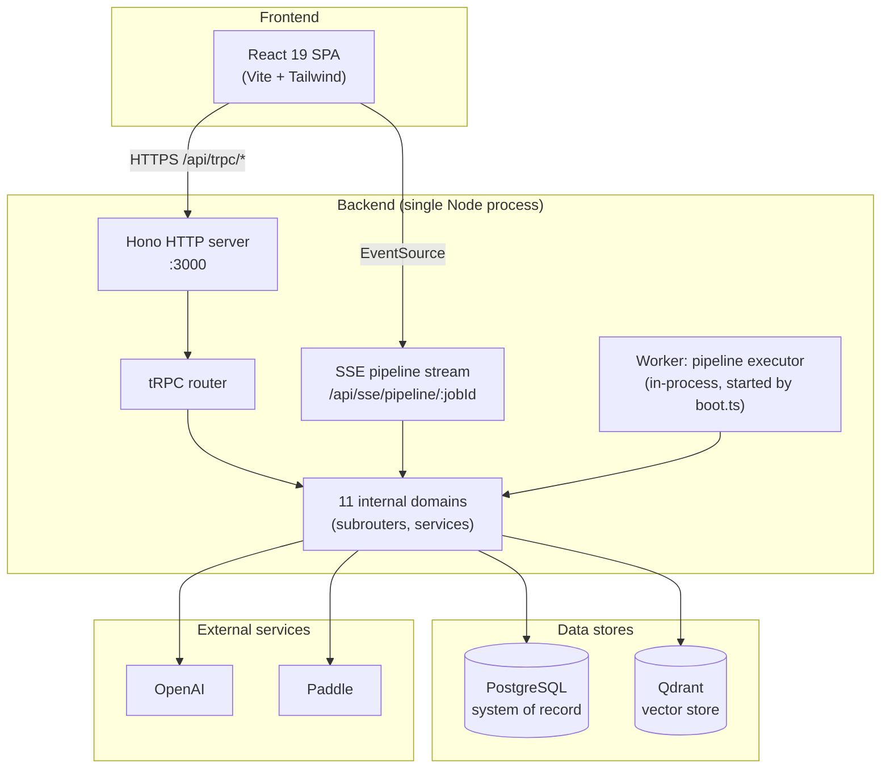

# Container Model

The C4 Level 2 view. Inside the [system boundary](domain-map.md), what runs, what it is built with, and which pieces can scale independently. The honest summary is: **one SPA, one server process, one job worker, three data stores.** The "11 domains" are an internal organization inside the one server process, not separate services.

## The shape

## The 11 internal domains

A labeled cluster, not 11 boxes. Each domain owns a tRPC subrouter, its DB tables, and its service code.

| # | Domain | tRPC key | Responsibility |
|---|---|---|---|
| 1 | analysis | `analysis` | Runs the semantic + optimization stages; writes `listing_analyses` |
| 2 | apollo | `apollo` | Outbound to Apollo for prospect enrichment |
| 3 | booking | `booking` | Booking flow + subscription mirror from Paddle webhooks |
| 4 | branding | `branding` | White-label settings (logo, color) per prospect |
| 5 | catalog | `catalogGraph` | COSMO knowledge-graph edges (`catalog_links`) |
| 6 | listing | `scraper` | Amazon scrape → `listings` table, plus embeds |
| 7 | optimization | `agents` | Orchestrates the pipeline, calls OpenAI, writes copy |
| 8 | pipeline | (internal) | DAG executor: stages, retries, state |
| 9 | ppc | `ppc` | PPC keyword and bulksheet generation |
| 10 | prospect | `prospects` | Lead CRUD, activity log |
| 11 | rufus | `rufusTracker` | Rufus query runs, SOV tracking, COSMO readiness |

Wired in [api/trpc/router.ts:13](../../api/trpc/router.ts). The 10 tRPC keys (note: `pipeline` is not exposed as a router — it is an internal executor) are the public API surface.

## Container table

| Container | Technology | Responsibility | Scales independently? |
|---|---|---|---|
| **React 19 SPA** | React 19 + Vite + Tailwind, React Router, TanStack Query | Renders the dashboard, runs the analysis wizard, subscribes to SSE for live pipeline progress | No (deployed as static assets via Vercel; CDN-scale) |
| **Hono HTTP server** | Hono 4 on Node 20, single process, Vercel function in prod | Hosts tRPC handler, SSE handler, HTTP routes (Paddle webhook, health) | No (one process, one function) [`ref: api/boot.ts:8`](../../api/boot.ts) |
| **tRPC router** | tRPC 11 with React Query client | Type-safe RPC; the only public API for the SPA | No (inside the Hono process) |
| **SSE pipeline stream** | Native `EventSource` over Node `http` | Pushes per-stage progress to the browser for the running job | No (same process as Hono) [`ref: api/boot.ts:64`](../../api/boot.ts) |
| **Worker (pipeline executor)** | In-process executor, started by `boot.ts` in non-Vercel env | Drains the `jobs` table, runs the DAG, retries failed stages | **Yes** — can be run as a separate process pointing at the same DB [`ref: api/boot.ts:65`](../../api/boot.ts) |
| **11 internal domains** | Plain TS modules, no framework | Encapsulate one business capability each | No (inside the Hono process) |
| **PostgreSQL** | Postgres 16, Drizzle ORM | System of record for all entities | **Yes** — managed separately; the only stateful backend dependency [`ref: api/db/schema.ts:1`](../../api/db/schema.ts) |
| **Qdrant** | Qdrant vector DB | Stores listing + competitor embeddings; semantic search | **Yes** — independent service, scale horizontally |
| **OpenAI** | External API | Embeddings (`text-embedding-3-small`) + chat completions | External; rate-limited per API key |
| **Paddle** | External billing | Subscription lifecycle via webhooks | External |

## Deployment reality

Today the system deploys as:

- **One Vercel function** — `api/index.ts` re-exports the Hono app's HTTP handlers [`ref: api/index.ts:4`](../../api/index.ts). In Vercel, the worker is **not** started (guarded by `!process.env.VERCEL`) [`ref: api/boot.ts:60`](../../api/boot.ts).
- **One Node process** for self-hosted / VPS — `pnpm dev:server` runs `tsx api/boot.ts`, which starts the Hono HTTP listener **and** the worker in the same process [`ref: api/boot.ts:65`](../../api/boot.ts).
- **One Vite dev server** — `pnpm dev` runs Vite with a proxy from `/api` to the Hono server on `:3000` [`ref: vite.config.ts:7`](../../vite.config.ts).
- **PostgreSQL + Qdrant** — run locally or as managed services; the URLs come from `.env` [`ref: .env.example:2`](../../.env.example).

The "11 domains" are a code-organization unit, not a deployment unit. There is no `analysis` service, no `pipeline` service. Pulling them apart would require carving the worker into its own process and giving it the same DB.

## Boundaries inside the process

Even though it deploys as one process, the internal boundaries matter for ownership:

- **Domains own their tables.** `api/domains/<name>` declares both the tRPC subrouter and the schema imports. Cross-domain reads go through a public procedure, not direct table access.
- **The pipeline executor is the only consumer of the `jobs` table.** All other code submits work via a procedure, not by inserting into the queue.
- **The SSE handler is read-only.** It streams `pipeline_job_stages` rows; it never mutates state.

## What this doc is not

This is the *shape* of the system. The internals of each container — the pipeline stage types, the React component tree, the Drizzle relation graph — are C4 Level 3 and live under [40-architecture/](../40-architecture/).

## Related

- [Domain map](domain-map.md) — Level 1, what's outside the system
- [Product vision](product-vision.md) — what the system is for
- [Pipeline stages](../30-reference/pipeline-stages.md) — the DAG the worker executes
