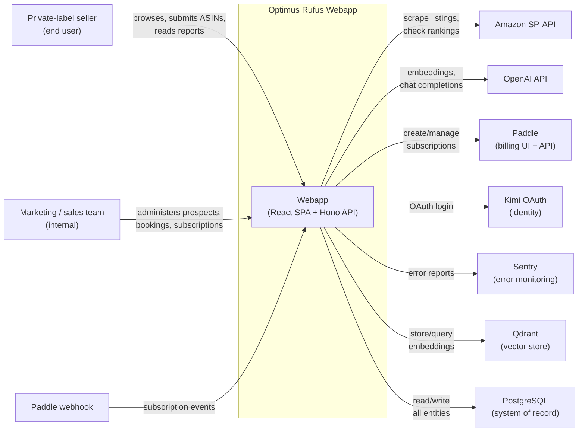

# Domain Map

The C4 Level 1 view. Who is outside the system, who is inside, and what crosses the boundary. Internal containers and components are out of scope here; see [container model](container-model.md) for the inside view.

## Actors

| Actor | Role | Notes |
|---|---|---|
| Private-label seller (end user) | Primary user; submits ASINs, reads reports, tracks rankings | The product's ICP. See [product vision](product-vision.md). |
| Marketing / sales team (internal) | Drives prospects into the funnel, manages bookings and Paddle subscriptions | Operates the app but is a thin actor; mostly administrative. |
| Engineering team (internal) | Owns the platform, runs the pipeline, manages deployments | Reader of this doc. |
| Paddle webhook | Receives payment lifecycle events from Paddle | The only "user" that calls us. |

## External systems

| System | What we use it for | Direction | Where it is wired |
|---|---|---|---|
| **Amazon SP-API** | Source of listing data (title, bullets, A+, images, price) and ranking checks | Outbound scrape + read-only lookups | `listing` domain |
| **OpenAI** | Embeddings (`text-embedding-3-small`) and chat completions for the analysis & copy agents | Outbound API calls | `optimization`, `analysis` domains |
| **Paddle** | Subscription billing and webhook-driven entitlement updates | Inbound webhooks + outbound dashboard | `booking` domain, Paddle webhook route |
| **Kimi OAuth** | Identity provider for the end-user login flow | OAuth redirect + token validation | Frontend + `booking` |
| **Sentry** | Frontend and backend error monitoring | Outbound error reports | Wired via `SENTRY_DSN` [`ref: .env.example:31`](../../.env.example) |
| **Qdrant** | Vector store for competitor embeddings and semantic search | Outbound upsert + query | `optimization` domain |
| **PostgreSQL** | System of record (prospects, listings, analyses, jobs) | Outbound queries via Drizzle ORM | All domains [`ref: api/db/schema.ts:1`](../../api/db/schema.ts) |

## System context

The **Optimus Rufus Webapp** boundary is intentionally drawn as one box. It contains 11 internal domains — see [container model](container-model.md) for the breakdown. The 11 domains are an internal organization, not separate deployable services.

## Boundaries, stated explicitly

- **We do not call Amazon from the browser.** All Amazon traffic is server-side; the API key never leaves the Hono process.
- **We do not call OpenAI from the browser.** All completion and embedding calls go through the `optimization` domain, which holds the API key and rate-limits per prospect.
- **Paddle is the only inbound webhook** that mutates state without a user session. It is the source of truth for subscription status; the local mirror can be wrong until the next webhook.
- **Sentry is observational only.** Removing it does not change behavior. It is a dependency, not a control plane.

## Out of scope at this level

- The 11 internal domains (Level 2). See [container model](container-model.md).
- The pipeline DAG, stage types, and retry policy (Level 3).
- Data model columns, tRPC procedure signatures, env var list. All reference material, see [reference index](../README.md).

## Open questions

- Will we ever need a second identity provider for non-Kimi regions? The OAuth boundary is Kimi-shaped today.
- Is Paddle permanent, or do we expect a Stripe migration? The webhook boundary is the only place a billing migration would matter.

## Related

- [Product vision](product-vision.md) — what we sell and why
- [Container model](container-model.md) — Level 2, what's inside the system boundary
- [Glossary](../glossary.md) — terms used in the diagram (COSMO, Rufus, AEO)
