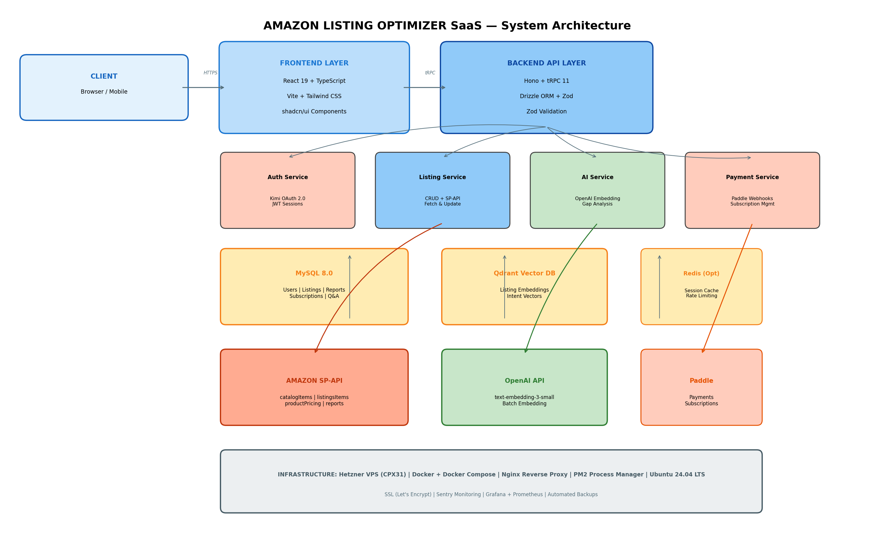
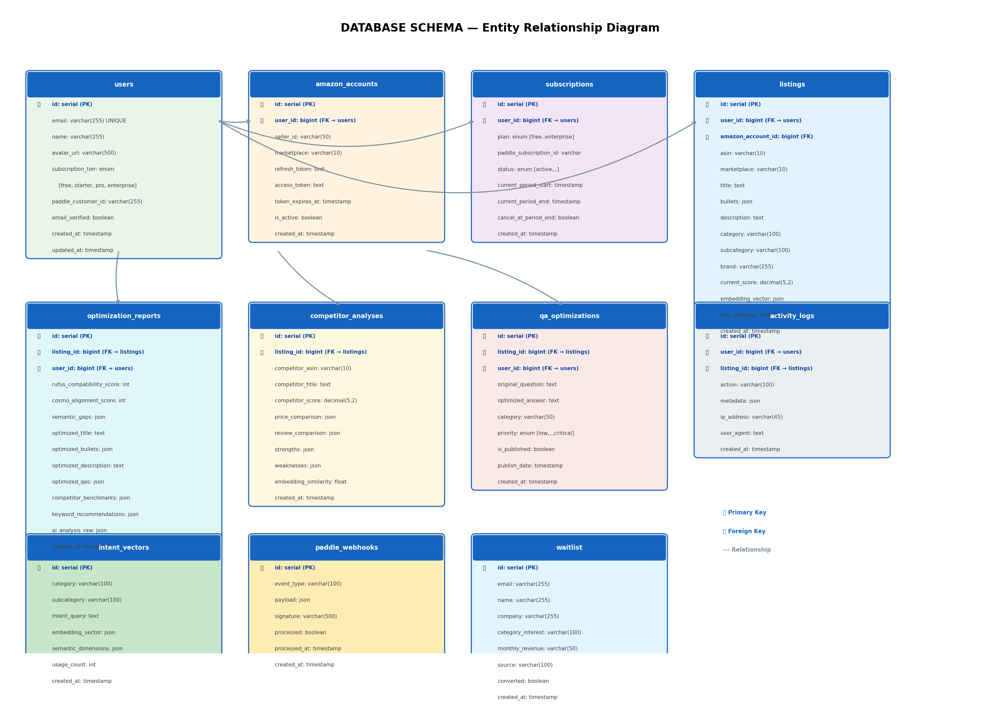
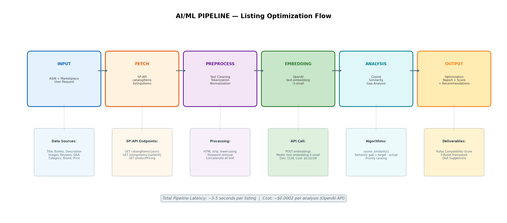

# Amazon Listing Optimizer SaaS
## Complete Documentation Suite

**Version:** 1.0  
**Last Updated:** 2026-05-30  
**Status:** MVP Ready for Development  

---

## Project Overview

Amazon Listing Optimizer, health/supplements ve beauty kategorisinde Amazon'da satış yapan private label markalar için AI-destekli bir listing optimizasyon SaaS platformudur. Amazon'un COSMO (Common Sense Knowledge Graph) ve Rufus (Conversational AI Shopping Assistant) sistemlerini analiz ederek, satıcıların listing'lerini bu AI sistemlere göre optimize etmelerine yardımcı olur.

### Key Differentiators
- **AI-Native:** Semantic meaning ve user intent alignment (keyword stuffing değil)
- **Rufus Compatibility Score:** Listing'in Amazon AI'siyle ne kadar uyumlu olduğunu 0-100 skorla gösterir
- **Semantic Gap Analysis:** 24 boyutta eksiklik analizi ve önceliklendirme
- **COSMO Optimized:** Amazon'un knowledge graph ilişkilerine göre optimize edilmiş içerik üretir

---

## Documentation Index

| Section | Documents | Purpose | Audience |
|---------|-----------|---------|----------|
| **[01-product](./01-product/)** | PRD, Roadmap | Features, user stories, requirements | Product Owner, Stakeholders |
| **[02-research](./02-research/)** | AI Research | COSMO/Rufus deep-dive, methodology | Researchers, PMs |
| **[03-business](./03-business/)** | Finance, Marketing, VPS | Business model, GTM, infra needs | Founder, Marketing |
| **[04-architecture](./04-architecture/)** | System Design | Tech stack, data flow, scalability | Architects, Tech Lead |
| **[05-development](./05-development/)** | API, DB, AI, Setup | Implementation guides & reference | All Developers |
| **[06-operations](./06-operations/)** | Security, Deployment, DevOps | Auth, infra, monitoring, CI/CD | DevOps, Developers |

---

## Quick Reference

### Technology Stack

```
Frontend:     React 19 + TypeScript + Vite + Tailwind CSS + shadcn/ui
Backend:      Hono + tRPC 11 + Drizzle ORM + Zod
Database:     PostgreSQL 16 + Qdrant (Vector DB)
AI/ML:        OpenAI text-embedding-3-small (1536-dim)
Auth:         Kimi OAuth 2.0 + JWT Sessions
Payments:     Paddle (Subscriptions)
Hosting:      Hetzner VPS (CPX31) + Docker
Monitoring:   Sentry + Grafana + Prometheus
```

### Architecture Diagram



### Database ERD



### AI Pipeline Flow



---

## Getting Started

### For Developers

1. **Start here:** [Development Setup Guide](./05-development/setup.md)
2. **Understand the system:** [Technical Architecture](./04-architecture/technical-architecture.md)
3. **Build features:** [API Specification](./05-development/api-specification.md) + [Database Schema](./05-development/database-schema.md)
4. **Deploy:** [Deployment & DevOps](./06-operations/deployment-devops.md)

### For Product/Business

1. **Understand the product:** [Product Requirements](./01-product/requirements.md)
2. **See the vision:** Check Architecture Diagram above
3. **Review business case:** [Financial Analysis](./03-business/financial-analysis.md)

### For DevOps/Infrastructure

1. **Infrastructure:** [Deployment & DevOps](./06-operations/deployment-devops.md)
2. **Security review:** [Security & Authentication](./06-operations/security-authentication.md)
3. **VPS requirements:** [VPS Requirements](./03-business/vps-requirements.md)

---

## Project Statistics

| Metric | Value |
|--------|-------|
| **Documents** | 14 comprehensive technical & business docs |
| **Diagrams** | 13 visual assets |
| **API Endpoints** | 30+ tRPC procedures |
| **Database Tables** | 11 tables |
| **Frontend Pages** | 8 route-level pages |
| **AI Dimensions** | 24 semantic dimensions |
| **MVP Timeline** | 8-10 weeks |
| **Monthly Infrastructure Cost** | ~$50-100 |

---

## Development Timeline

### Phase 1: Foundation (Weeks 1-2)
- [ ] VPS setup + Docker configuration
- [ ] Frontend + Backend initialization
- [ ] Database schema + migrations
- [ ] Authentication (Kimi OAuth)

### Phase 2: Core Features (Weeks 3-5)
- [ ] ASIN fetch + listing display
- [ ] OpenAI embedding integration
- [ ] Semantic gap analysis algorithm
- [ ] Rufus Compatibility Score
- [ ] Optimized title + bullets generation

### Phase 3: Polish (Weeks 6-7)
- [ ] Competitor benchmark
- [ ] Q&A optimization
- [ ] Paddle payment integration
- [ ] Subscription management
- [ ] UI/UX refinement

### Phase 4: Launch (Week 8+)
- [ ] Production deployment
- [ ] Monitoring setup
- [ ] Beta testing
- [ ] Product Hunt launch
- [ ] Marketing push

---

## Cost Breakdown

### Development Costs

| Item | Cost | Notes |
|------|------|-------|
| VPS (Hetzner CPX31) | $33/month | 8 vCPU, 32 GB RAM |
| Domain | $10/year | Namecheap/Cloudflare |
| OpenAI API | $2-5/month | Embedding costs |
| Paddle | 5% commission | On successful payments |
| Sentry (Free tier) | $0 | 5,000 errors/month |
| **Total Monthly** | **~$40-50** | MVP operational cost |

### Revenue Projections

| Metric | Month 1 | Month 3 | Month 6 | Month 12 |
|--------|---------|---------|---------|----------|
| Users | 50 | 200 | 500 | 1,500 |
| Paid Users (20%) | 10 | 40 | 100 | 300 |
| MRR | $500 | $3,000 | $7,500 | $22,500 |
| Monthly Profit | $450 | $2,950 | $7,450 | $22,450 |

---

## Support & Resources

### External Documentation
- [OpenAI Embedding API](https://platform.openai.com/docs/guides/embeddings)
- [Paddle Documentation](https://developer.paddle.com/)
- [tRPC Documentation](https://trpc.io/docs)
- [Drizzle ORM Docs](https://orm.drizzle.team/)
- [Hono Framework](https://hono.dev/)
- [shadcn/ui Components](https://ui.shadcn.com/docs)

### Community Resources
- [r/FulfillmentByAmazon](https://reddit.com/r/FulfillmentByAmazon) — 110K+ sellers
- [Amazon FBA High Rollers (Facebook)](https://facebook.com/groups/amazonfbahighrollers) — 76K+ members
- [ASGTG (Facebook)](https://facebook.com/groups/asgtg) — 77K+ members

---

## License

MIT License — Commercial use permitted

## Contact

- **Developer:** [Your Name]
- **Email:** [your-email@domain.com]
- **LinkedIn:** [Your LinkedIn]
- **Website:** [yourdomain.com]

---

*This documentation suite was generated on 2026-05-30 and represents the complete technical specification for the Amazon Listing Optimizer SaaS MVP.*
